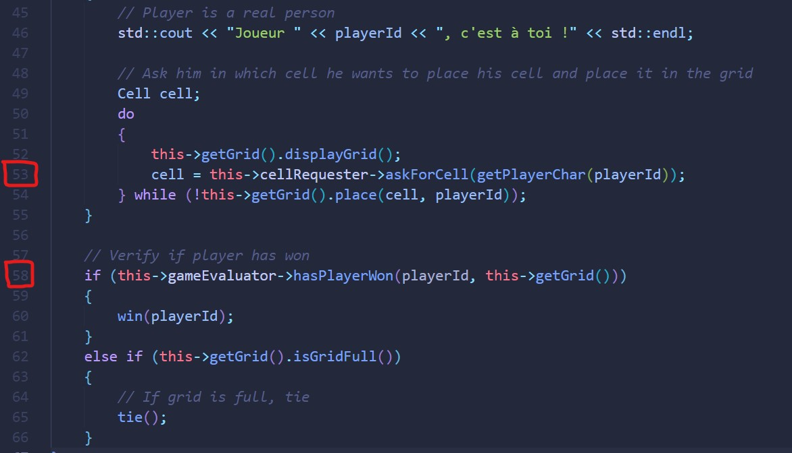

# Rapport TP4 
#### `Franck GUTMANN & Julien VON DER MARCK`

## Choix du projet

Nous avons choisi le projet de Franck, bien qu'il n'y ai pas eu d'arguments majeurs en faveur d'un projet ou l'autre.

### Commentaires lors de la code reviews de nos projets mutuels :

#### **Julien :**

* Dans la classe Game : on gère si on a gagné le jeu ou non donc la classe fait trop de choses, trop de responsabilités, elle initiliase la grille, etc

* Pas de moyen de réutiliser des méthodes d'évalutation et de placement de pions : ces méthodes sont implémentés individuellement dans chaque jeu.

* Not KIS : not keep it simple

#### **Franck :**

* Algorithme de vérification de victoire mérite une optimisation.

* Pas de moyen de réutiliser des méthodes d'évalutation et de placement de pions : ces méthodes sont implémentés individuellement dans chaque jeu.

## Implémentation des principes SOLID

* **Open-Closed** : initialement pas respecté. Après refactor, nous ne modifions plus Game mais on crée une nouvelle classe implémentant CellRequester ou GameEvaluator pour étendre les fonctionnalités.

* **Single Responsibility** : Partiellement respecté initialement. Après refactor, chaque classe a désormais une unique responsabilité.

* Pas d'utilisation du principe de **Liskov** : aucune implémentation possible de créer une classe qui hérite d’une autre pour changer son type dans une méthode, on est pas obligé de faire deux interfaces différentes

* Pas d'**Interface Segregation** : nos interfaces ne sont pas assez fourni pour avoir recours à ce principe.

* **Dependency inversion** : on utilise directement le type de l’interface et non pas les classes qui les implémentent, permet une faible 

### Détails des modifications :

- Déplacement de la méthode `firstRowAvailableInCol()` de la classe `Power4` à la classe `Grid`, car sinon la classe `Power4` a plusieurs responsabilités et si dans le futur on modifie l'état de notre grille on devra aussi faire la modification dans la classe `Power4` ce qui n'est pas du tout une bonne manière d’après le principe de ***Single Responsability***.

- Création d’interfaces `CellRequester` et `GameEvaluator` permettant d'implémenter n’importe quelle méthode de demande de case au joueur et de détermination du gagnant sans altérer le code en place :    

    - La classe `Game` a deux variables nommés `gameEvaluator` de type `GameEvaluator` et `cellRequester` de type `CellRequester` qui sont toutes les deux des interfaces. 

    - Interface `CellRequester` : Une classe qui s’occupe de demander une cellule du joueur avec plusieurs implémentations possibles selon les jeux (dans `Game`). Dans `Power4` et `TicTacToe` on va créer une classe qui va implémenter l’interface `CellRequester` s'appellant `Power4CellRequester` et `TicTacToeCellRequester` qui vont définir la méthode `askForCell()` qui est différente des deux modes de jeux.

    Modifications efféctuées dans la classe `Game` :
    

    Comme le montre l'image ci-dessus, on utilise le principe de ***Dependency Inversion***, à la ligne 53, la variable `cellRequester` est de type `CellRequester` qui provient de l'interface directement, on n'indique pas ici une variable de type `Power4CellRequester` ou `TicTacToeCellRequester`, cela évite de faire des conditions inutile et d'éviter un couplage fort.  

    - Interface `GameEvaluator` : Dans le package `defaults`, on crée une classe `DefaultGameEvaluator` (qui implémente l'interface `GameEvaluator`) qui sera par défaut commune pour les deux modes de jeux `Power4` et `TicTacToe`. Le but étant de retirer à la grille la responsabilité de compter les pions consécutifs d'un joueur. L'interface `GameEvaluator` aura donc pour unique responsabilité de déterminer si un joueur a gagné un jeu ou non en mettant une unique méthode appellée `hasPlayerWon()`. 

> Travail effectué en groupe de deux personnes (Franck Gutmann et Julien Von Der Marck). Modification et évaluation du code fait en live share sur VScode. 
